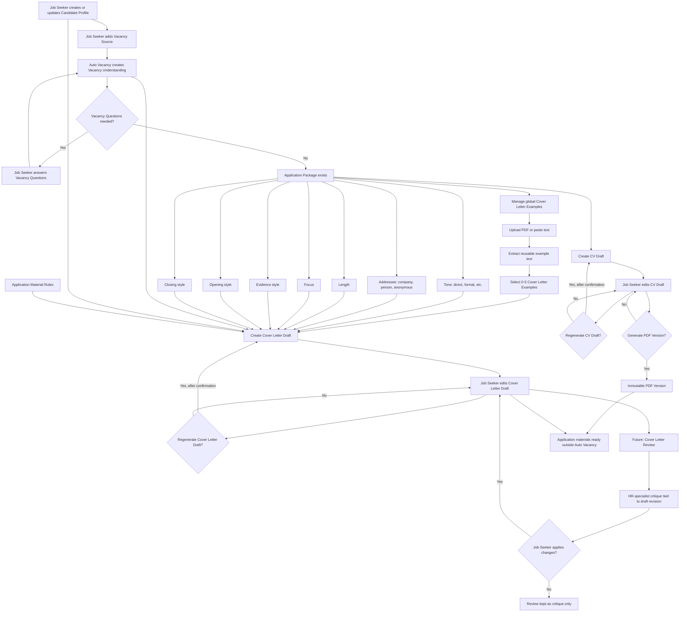

# CV and Cover Letter Process

Note: exact placement of the Cover Letter step is provisional until prototyping. Current assumption: available once the Application Package exists, shown after the CV workspace.
